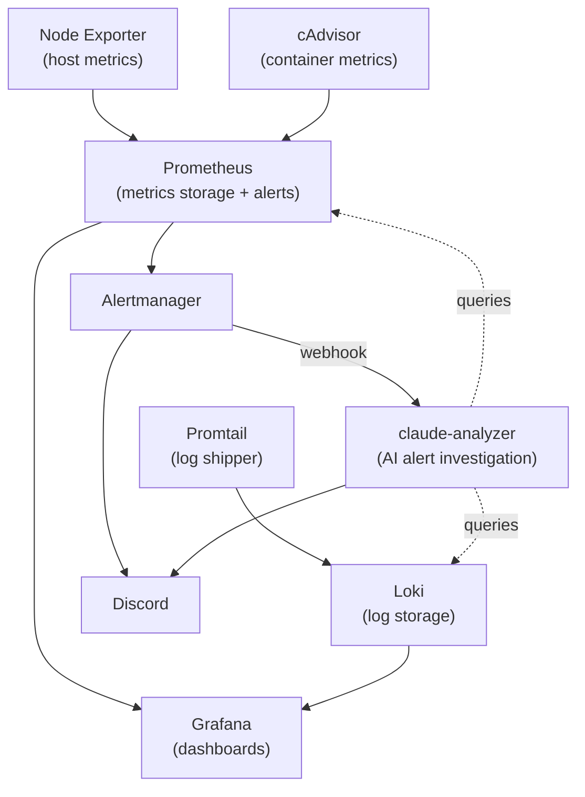

# Home Lab Monitoring Stack

Docker Compose-based monitoring stack for a home lab server. Collects system metrics, container metrics, and logs, with alerting to Discord.

Originally based on the [Prometheus + Docker Compose guide](https://last9.io/blog/prometheus-with-docker-compose/) by Last9.

## Architecture



## Components

| Service | Purpose | Port |
|---|---|---|
| **Prometheus** | Metrics collection, storage (15d retention), and alert evaluation | `9090` |
| **Node Exporter** | Host-level metrics (CPU, memory, disk, network) | `9100` |
| **cAdvisor** | Container resource usage metrics | `8088` |
| **Grafana** | Dashboards and visualization | `3000` |
| **Loki** | Log aggregation and storage (15d retention) | `3100` |
| **Promtail** | Log shipping from Docker containers and systemd journal | - |
| **Alertmanager** | Alert routing and notifications via Discord | `9093` |
| **claude-analyzer** | AI alert investigation: on each firing alert, queries Prometheus/Loki with Claude and posts an enriched hypothesis to Discord | internal only |

All ports are bound to `127.0.0.1` (localhost only). `claude-analyzer` publishes no port — Alertmanager reaches it over the internal `monitoring` network.

## AI Alert Analysis (`claude-analyzer`)

Cheap deterministic rules stay the trigger; Claude does the investigation burst. When an alert fires, Alertmanager posts the raw notification to Discord **and** webhooks `claude-analyzer`, which investigates that specific alert (correlating Prometheus metrics and Loki logs via a shared, token-efficient tool layer) and posts a short hypothesis as a follow-up message. If the analyzer or the Claude API is down, the raw alert is unaffected.

The same tools are exposed over MCP (`analyzer/mcp_server.py`, registered in `.mcp.json`) for ad-hoc debugging from Claude Code using your subscription — no API key. The automated webhook path uses an `ANTHROPIC_API_KEY`.

The MCP launcher (`analyzer/mcp-launch.sh`) opens an SSH tunnel to the server on demand (Prometheus/Loki are bound to `127.0.0.1`), so no manual port-forwarding is needed. Server details are **not** stored in the repo — the launcher references an `~/.ssh/config` Host alias. Add one on your laptop:

```sshconfig
# ~/.ssh/config
Host homelab-monitoring
    HostName <your-server-ip>
    Port     <your-ssh-port>
    User     <your-user>
```

If your alias already has a different name, point the launcher at it via the `MONITORING_SSH` env var in `.mcp.json`:

```json
{
  "mcpServers": {
    "home-lab-monitoring": {
      "command": "bash",
      "args": ["analyzer/mcp-launch.sh"],
      "env": { "MONITORING_SSH": "your-alias" }
    }
  }
}
```

The launcher prefers `uv`; if it's absent it falls back to a local `.venv`.

### Setup

```sh
# 1. API key (gitignored), used only by the webhook service
cp analyzer/.env.example analyzer/.env
# edit analyzer/.env and set ANTHROPIC_API_KEY=...

# 2. Shared secret between Alertmanager and the analyzer (gitignored)
openssl rand -hex 32 > alertmanager/analyzer_token
chmod 644 alertmanager/analyzer_token   # readable by both containers

# 3. Build and start
docker compose up -d --build claude-analyzer

# 4. Reload Alertmanager so it picks up the new webhook receiver
curl -X POST http://127.0.0.1:9093/-/reload   # or: docker compose restart alertmanager
```

Test end-to-end without waiting for a real alert by replaying the sample payload:

```sh
docker compose exec alertmanager \
  wget -qO- --header="Authorization: Bearer $(cat alertmanager/analyzer_token)" \
  --post-file=- http://claude-analyzer:8080/alert < analyzer/sample_alert.json
```

## Alert Rules

### Node alerts (`prometheus/rules/node_alerts.yml`)
- **HighCPULoad** - CPU usage > 80% for 5m
- **HighMemoryLoad** - Memory usage > 80% for 5m
- **HighDiskUsage** - Disk usage > 85% for 5m
- **UnusualMemoryGrowth** - Available memory declining at > 10MB/s for 10m

### Container alerts (`prometheus/rules/container_alerts.yml`)
- **ContainerRestarting** - Container restarted in the last 15m
- **ContainerHighMemoryUsage** - Container memory > 80% of limit for 5m
- **ContainerCPUThrottling** - Container CPU throttling > 25% for 5m

## Setup

### 1. Clone and start

```sh
git clone <repo-url>
cd home-lab-monitoring
docker compose up -d
```

### 2. Configure Discord webhook for Alertmanager

Alertmanager reads the Discord webhook URL from a file at `/etc/alertmanager/discord_webhook` (mounted from `./alertmanager/discord_webhook`). The file is gitignored so the secret stays out of the repo.

```sh
printf 'https://discord.com/api/webhooks/...' > alertmanager/discord_webhook
chmod 644 alertmanager/discord_webhook  # Alertmanager runs as UID 65534 inside the container
docker compose up -d alertmanager
```

Verify the config loaded cleanly:

```sh
docker logs alertmanager 2>&1 | grep -iE "error|level=ERROR" | tail
```

If the file is missing or its content has no `https://` scheme, Alertmanager fails to load the config with `unsupported scheme "" for URL` and no notifications are delivered.

### 3. Access the UIs

- **Grafana**: http://localhost:3000 (default: `admin` / `admin`)
- **Prometheus**: http://localhost:9090
- **Alertmanager**: http://localhost:9093

## Dashboards

Dashboards are auto-provisioned from `grafana/dashboards/`:

- [Node Exporter Full](https://grafana.com/grafana/dashboards/1860-node-exporter-full/)
- [Docker Container & Host Metrics](https://grafana.com/grafana/dashboards/10619-docker-host-container-overview/)
- UPS Power Monitor

## Updating Image Versions

A helper script queries Docker Hub and GCR for the latest stable tags and updates `docker-compose.yml`:

```sh
# Check for updates (no changes)
./update-images.sh --dry-run

# Check and apply updates (prompts for confirmation)
./update-images.sh
```

Requires `curl` and `jq`.

## Project Structure

```
.
├── alertmanager/
│   └── config.yml              # Alertmanager routing + Discord receiver
├── grafana/
│   ├── dashboards/             # Provisioned dashboard JSON files
│   └── provisioning/
│       ├── dashboards/         # Dashboard provisioning config
│       └── datasources/        # Prometheus + Loki datasource config
├── prometheus/
│   ├── prometheus.yml          # Scrape configs + alert rule loading
│   └── rules/
│       ├── container_alerts.yml
│       ├── node_alerts.yml
│       └── recording_rules.yml # Pre-computed metrics (CPU, memory)
├── promtail/
│   └── config.yml              # Docker + journal log scraping
├── docker-compose.yml
├── loki-config.yml
└── update-images.sh            # Image version updater
```
